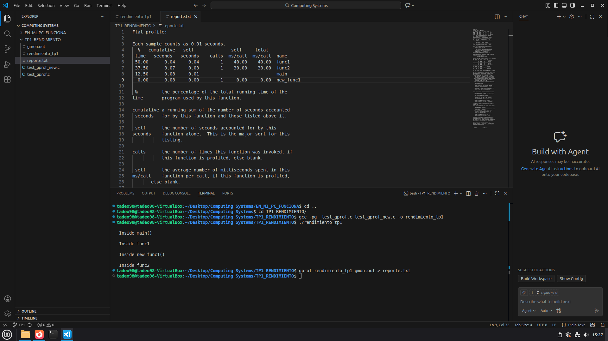

# TP1 – Rendimiento de las Computadoras

## Integrantes
- Antonino, Tadeo - tadeo.antonino@mi.unc.edu.ar
- Quintana, Ignacio Agustin - ignacio.agustin.quintana@mi.unc.edu.ar
- Fioramonti, Martino - martino.fioramonti@mi.unc.edu.ar

---

# Introducción

El rendimiento de un sistema informático se define como la capacidad de realizar un trabajo en un determinado tiempo. En particular, el rendimiento está inversamente relacionado con el tiempo de ejecución: a menor tiempo, mayor rendimiento.

En este trabajo se analizan distintos aspectos del rendimiento de un computador, incluyendo el uso de benchmarks, la comparación de procesadores y el análisis de performance de programas mediante herramientas de medición.

---

# 1. Lista de benchmarks útiles

Un benchmark es un programa que permite medir el rendimiento de un sistema ejecutando una tarea específica. Según la teoría, el rendimiento de un computador está directamente relacionado con el tiempo que tarda en ejecutar un programa: a menor tiempo, mayor rendimiento.

Algunos de los benchmarks que analizamos son:
  - [3DMark Wild Life Extreme](https://openbenchmarking.org/tests/pts/3dmark)
  

---

## Cuáles son más útiles?
    (completar)

---

# 2. Tabla: tareas diarias vs benchmarks

| Tarea diaria                         | Benchmark representativo           | Explicación |
|------------------------------------|----------------------------------|------------|
| Compilar código                    | build-linux-kernel               | Simula carga real de CPU y paralelismo |
| Ejecutar programas propios         | gprof / perf                    | Permite analizar qué funciones consumen tiempo |
| Navegación web                     | Geekbench (parcialmente)         | Evalúa rendimiento general |
| Desarrollo de software             | build-linux-kernel + profiling   | Combina rendimiento real y análisis interno |

Conclusión:  
Los benchmarks más útiles son aquellos que representan el uso real del sistema, ya que permiten medir el rendimiento en condiciones cercanas a la práctica.

---

# 3. Rendimiento de procesadores 

Se analiza el rendimiento de distintos procesadores ejecutando la compilación del kernel de Linux.

## 🔹 Procesadores analizados

- Intel Core i5-13600K
- AMD Ryzen 9 5900X
- AMD Ryzen 9 7950X

## 🔹 Resultados

| Procesador          | Núcleos | Tiempo (s) | Rendimiento (1/tiempo) |
|--------------------|--------|-----------|------------------------|
| i5-13600K          | 14     | 72        | 0.0139                 |
| Ryzen 9 5900X      | 12     | 76        | 0.0132                 |
| Ryzen 9 7950X      | 16     | 50        | 0.0200                 |

## Análisis

- El **tiempo de ejecución** es la métrica principal de rendimiento.
- El **Ryzen 9 7950X** es el más rápido (menor tiempo).
- El **Ryzen 9 5900X** rinde ligeramente peor que el i5 en este caso.

Conclusión:  
El rendimiento no depende solo de la cantidad de núcleos, sino también de la arquitectura y frecuencia.

---

# 4. Speedup (aceleración)

El speedup mide cuánto mejora un sistema respecto a otro.

Speedup = Tiempo referencia / Tiempo nuevo

Tomando como referencia el i5:

| Procesador     | Speedup |
|---------------|--------|
| i5-13600K     | 1.00   |
| Ryzen 9 5900X | 0.95   |
| Ryzen 9 7950X | 1.44   |

## Análisis

- El **Ryzen 9 7950X** es 1.44 veces más rápido que el i5.
- El **5900X** es levemente más lento.

Conclusión:  
El speedup permite comparar mejoras relativas entre sistemas.

---

# 5. Eficiencia

## 🔹 Eficiencia por cantidad de núcleos

Eficiencia = Speedup / número de núcleos

| Procesador     | Núcleos | Eficiencia |
|---------------|--------|-----------|
| i5-13600K     | 14     | 0.0714    |
| Ryzen 9 5900X | 12     | 0.0789    |
| Ryzen 9 7950X | 16     | 0.0900    |

## Análisis

- El **7950X** aprovecha mejor sus núcleos.
- Mayor eficiencia implica mejor paralelización.

---

## 🔹 Eficiencia por costo

| Procesador     | Costo | Eficiencia |
|---------------|------|-----------|
| i5-13600K     | 284  | 0.00352   |
| Ryzen 9 5900X | 278  | 0.00341   |
| Ryzen 9 7950X | 549  | 0.00262   |

## Análisis

- El **i5-13600K** tiene mejor relación costo/rendimiento.
- El **7950X** es potente pero caro.

Conclusión:  
Hay que balancear rendimiento y costo según el uso.

---

# 6. Profiling (análisis de rendimiento del código)

## 🔹 ¿Qué es el profiling?

El profiling es una técnica que permite medir el tiempo de ejecución de un programa y, más importante aún, cuánto tiempo consume cada función.

A diferencia de medir solo el tiempo total, el profiling permite identificar cuellos de botella, es decir, partes del código que consumen más tiempo.

Herramientas utilizadas:
- `gprof`: inserta código para medir tiempos de cada función
- `perf`: usa muestreo del sistema operativo

---

## 🔹 Resultados obtenidos

Se realizó una medición experimental en las computadoras personales de cada integrante utilizando un programa en C con múltiples funciones y bucles intensivos.

(completar)

### Estimación de tiempos por función

| Función     | Tiempo (s) | % del total |
|------------|-----------|-------------|
| func1      | 6.720     | 52.0%       |
| func2      | 4.864     | 37.6%       |
| new_func1  | 1.280     | 9.9%        |
| main       | 0.064     | 0.5%        |
| **Total**  | **12.928**| **100%**    |

---

## Análisis

- `func1` consume la mayor parte del tiempo total
- `func2` también tiene un impacto significativo
- `new_func1` tiene menor impacto relativo
- `main` tiene un impacto despreciable

Esto indica que:
- El rendimiento del programa depende principalmente de `func1` y `func2`
- Estas funciones serían las principales candidatas para optimización

---

---

## Conclusión del profiling

- El profiling permite analizar el rendimiento interno de un programa
- En este caso, se identificaron las funciones más costosas mediante análisis del código
- Es fundamental para optimizar correctamente, enfocándose en las partes críticas del programa

---

# Conclusión general

- El rendimiento se mide principalmente por el tiempo de ejecución
- Los benchmarks más útiles son los que simulan uso real
- El Ryzen 9 7950X es el más rápido, pero no el más eficiente en costo
- El i5-13600K ofrece mejor balance costo/rendimiento
- El profiling permite detectar los verdaderos cuellos de botella del código
