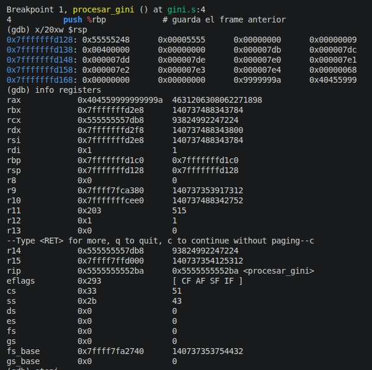
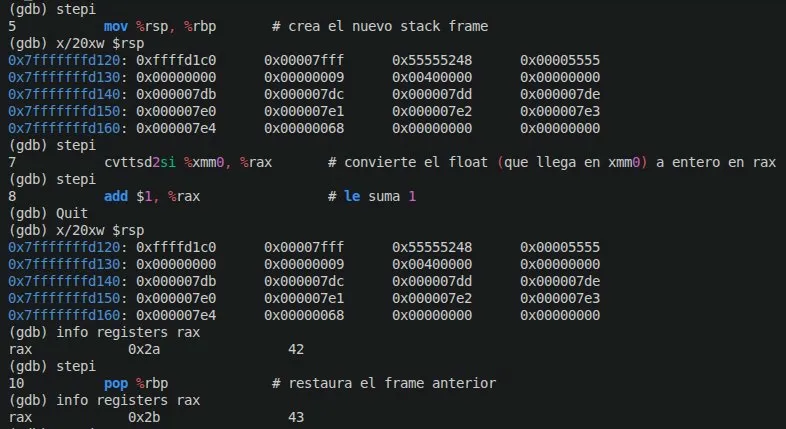
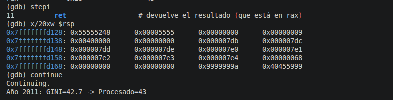

# TP2

## Integrantes
- Antonino, Tadeo - tadeo.antonino@mi.unc.edu.ar
- Quintana, Ignacio Agustin - ignacio.agustin.quintana@mi.unc.edu.ar
- Fioramonti, Martino - martino.fioramonti@mi.unc.edu.ar

---

## Introducción

Este trabajo práctico tiene como objetivo entender cómo funciona la convención de llamadas
entre lenguajes de alto y bajo nivel, y cómo se organiza la memoria a través del stack
en arquitecturas x86-64.

Para ello se utiliza el índice GINI de Argentina como caso de estudio. Python obtiene los datos
desde internet y los entrega a C, que los pasa al ensamblador siguiendo la convención
System V AMD64 ABI. A través de GDB se puede observar en tiempo real cómo se construye
y destruye el stack frame en cada llamada a función, cómo viajan los argumentos en los registros,
y cómo se devuelve el resultado en %rax.

## ¿Qué es el índice GINI?

El índice GINI es un número que mide la **desigualdad económica** de un país.
Va de 0 a 100: cuanto más alto, más desigual es la distribución de la riqueza entre la población.
Por ejemplo, un país con GINI 50 es más desigual que uno con GINI 30.

---

## ¿Qué hace este programa?

Este programa obtiene el índice GINI de Argentina entre 2011 y 2020
desde la API del Banco Mundial, y lo procesa en tres capas:

1. **Python** se conecta a internet y trae los datos del Banco Mundial.
2. **C** actúa de intermediario entre Python y el ensamblador.
3. **Ensamblador** recibe el valor GINI, lo convierte de float a entero y le suma 1.

---

## ¿Qué es una API REST?

Es una forma de pedirle datos a un servidor de internet desde código,
como si fuera abrir un link en el navegador pero de forma automática.
En este caso le pedimos los datos a: 

https://api.worldbank.org/v2/en/country/all/indicator/SI.POV.GINI?format=json&date=2011:2020&per_page=32500&page=1&country=%22Argentina%22

---

## Archivos del proyecto

| Archivo | ¿Qué hace? |
|---|---|
| `gini.py` | Se conecta a la API, trae los datos y llama a la función de C via ctypes|
| `gini.c` | Declara la función de ensamblador y actúa de intermediario |
| `gini.s` | Implementa el cálculo en ensamblador x86-64 |
| `libgini.so` | Librería generada al compilar gini.c, usada por Python |

---

## ¿Cómo se conectan las tres capas?

Python → ctypes → C → Ensamblador

- **Python** no puede llamar a ensamblador directamente, necesita pasar por C.
- **C** usa `extern` para declarar que la función `procesar_gini` existe en el ensamblador.
- **El ensamblador** recibe el valor, hace el cálculo y devuelve el resultado en `%rax`.

La librería ctypes de Python permite cargar una librería dinámica .so y llamar
a sus funciones como si fueran funciones de Python. Así Python puede comunicarse con C,
y C con el ensamblador.

---

## ¿Qué hace el ensamblador?

Recibe el valor GINI como número con decimales (por ejemplo `42.7`) y:
1. Lo recibe en el registro %xmm0 — los números con decimales no viajan
en los registros normales sino en registros especiales llamados %xmm0, %xmm1, etc.
2. Lo convierte a entero con `cvttsd2si` → `42`
3. Le suma 1 con `add $1, %rax` → `43`
4. Devuelve el resultado en `%rax`

Se usa `long` porque se usan registros de 64 bits, y `%rax` es el registro donde se devuelven los resultados por convención.

---

## Convención de llamadas: Stack Frame y registros x86-64

La convención System V AMD64 ABI define cómo se pasan los argumentos entre funciones
en sistemas Linux de 64 bits. Es un conjunto de reglas que todos los programas siguen
para que C, ensamblador y Python puedan comunicarse correctamente.

| Registro | Uso |
|---|---|
| `%rdi` | 1er argumento entero |
| `%xmm0` | 1er argumento float/double |
| `%rax` | Valor de retorno |
| `%rbp` | Base pointer (ancla del stack frame) |
| `%rsp` | Stack pointer (cima del stack) |

El stack es una región de la memoria RAM que funciona como una pila.
Crece hacia abajo (hacia direcciones menores de memoria) y %rsp siempre
apunta a la cima. Cuando se llama a una función, se crea un nuevo stack frame
que contiene las variables locales y la dirección de retorno.

---

## Cómo ejecutarlo

### 1. Instalar dependencias
```bash
pip install requests
```

### 2. Compilar el ensamblador y la librería
```bash
as --64 -g -o gini_asm.o gini.s
gcc -g3 -O0 -c -o gini.o gini.c
gcc -shared -fPIC -o libgini.so gini.o gini_asm.o
```

### 3. Ejecutar el programa
```bash
python3 gini.py
```

---

## Ejemplo de salida


---

## Sesión GDB - Estado del Stack

Para demostrar cómo funciona el stack al llamar a la función ensamblador,
se utilizó GDB (GNU Debugger). GDB es un programa que permite pausar el código
mientras corre y espiar qué está pasando adentro: registros, memoria, stack, etc.

Para la sesión de GDB se utilizó un ejecutable de C puro con los valores reales. Esto simplifica la depuración ya que GDB trabaja directamente sobre el ejecutable. Los valores usados son exactamente los mismos que devuelve la API, por lo que la demostración del stack es válida y representa el comportamiento real
del programa.

Los comandos utilizados fueron:

```bash
gcc -g3 -O0 -o programa gini.c gini_asm.o
gdb ./programa
```

Se puso un breakpoint en la función ensamblador:

```bash
break procesar_gini
run
```

### Antes de llamar a la función ensamblador

Se usó `x/20xw $rsp` para examinar 20 posiciones de memoria desde la cima del stack,
y `info registers` para ver el estado de todos los registros.
El stack pointer `%rsp` apunta a `0x7fffffffd128`. El programa está pausado
justo antes de ejecutar el `push %rbp`. Se pueden ver todos los registros en su estado inicial

### Durante la ejecución de la función ensamblador

Se avanzó instrucción por instrucción con `stepi` y se volvió a examinar el stack con `x/20xw $rsp`.
Después del `push %rbp`, el stack creció hacia abajo y `%rsp` bajó de
`0x7fffffffd128` a `0x7fffffffd120` (8 bytes menos, un espacio de 64 bits).
Se puede ver cómo `%rax` vale `0x2a` (42 en decimal) después de la conversión
de float a entero, y `0x2b` (43 en decimal) después de sumarle 1.

### Después del retorno de la función ensamblador

Tras ejecutar `stepi` hasta el `ret` y volver a examinar con `x/20xw $rsp`,
el stack volvió exactamente a su estado original con `%rsp` en `0x7fffffffd128`.
Esto demuestra que el stack frame se creó y se destruyó correctamente.
El programa imprime el resultado final:
```bash
Año 2011: GINI=42.7 -> Procesado=43.
```
---

## Conclusión

A través de este trabajo se pudo observar en la práctica cómo funciona el stack y la
convención de llamadas System V AMD64 ABI en arquitecturas de 64 bits.

Se verificó con GDB que:
- Cada llamada a función crea un stack frame propio que crece hacia abajo en memoria
- El valor anterior de `%rbp` se guarda en el stack al entrar a la función y se restaura al salir
- Los argumentos de tipo double viajan en registros especiales como %xmm0
- El resultado siempre se devuelve en `%rax` por convención
- El stack vuelve exactamente a su estado original después del `ret`, demostrando que
el stack frame se creó y destruyó correctamente