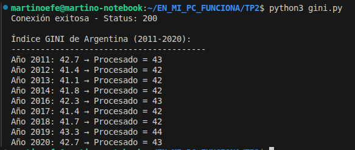

# TP2

## ¿Qué es el índice GINI?

El índice GINI es un número que mide la **desigualdad económica** de un país.
Va de 0 a 100: cuanto más alto, más desigual es la distribución de la riqueza entre la población.
Por ejemplo, un país con GINI 50 es más desigual que uno con GINI 30.

---

## ¿Qué hace este programa?

Este programa obtiene el índice GINI de Argentina entre 2011 y 2020
desde la API del Banco Mundial, y lo procesa en tres pasos:

1. **Python** se conecta a internet y trae los datos del Banco Mundial.
2. **C** recibe cada valor GINI, lo convierte de número con decimales a entero y le suma 1.
3. **Python** muestra los resultados finales por pantalla.

---

## ¿Qué es una API REST?

Es una forma de pedirle datos a un servidor de internet desde código,
como si fuera abrir un link en el navegador pero de forma automática.
En este caso le pedimos los datos a: 

https://api.worldbank.org/v2/en/country/all/indicator/SI.POV.GINI?format=json&date=2011:2020&per_page=32500&page=1&country=%22Argentina%22

---

## Archivos del proyecto

| Archivo | ¿Qué hace? |
|---|---|
| `gini.py` | Se conecta a la API, trae los datos y llama a la función de C |
| `gini.c` | Recibe el valor GINI, lo convierte a entero y le suma 1 |
| `libgini.so` | Librería generada al compilar gini.c, usada por Python |

---

## ¿Cómo se conectan Python y C?

Python no puede llamar a C directamente, necesita un puente.
Ese puente se llama **ctypes**, una librería de Python que permite
cargar y ejecutar funciones escritas en C.

El proceso es:
1. Se compila `gini.c` como una librería dinámica (`libgini.so`)
2. Python carga esa librería con `ctypes.CDLL`
3. Python llama a la función `procesar_gini()` pasándole cada valor GINI
4. C procesa el valor y devuelve el resultado a Python

---

## ¿Qué hace la función de C?

Recibe un número con decimales (por ejemplo `41.4`) y:
1. Lo convierte a entero → `41`
2. Le suma 1 → `42`
3. Devuelve el resultado a Python

Se usa el tipo `long` porque la arquitectura de 64 bits trabaja
con registros de 64 bits, y `long` es el tipo que los aprovecha correctamente.

---

## Cómo ejecutarlo

### 1. Instalar dependencias
```bash
pip install requests
```

### 2. Compilar la librería de C
```bash
gcc -shared -fPIC -g3 -o libgini.so gini.c
```

### 3. Ejecutar el programa
```bash
python3 gini.py
```

---

## Ejemplo de salida



## Próximos pasos 

- Reemplazar la función de C con código **Ensamblador**
- Mostrar el estado del **stack** con GDB antes, durante y después de la función
- Usar las convenciones de llamadas **System V AMD64 ABI**