# TP4 - Módulos de Kernel

## Integrantes
- Antonino, Tadeo - tadeo.antonino@mi.unc.edu.ar
- Fioramonti, Martino - martino.fioramonti@mi.unc.edu.ar
- Quintana, Ignacio Agustin - ignacio.agustin.quintana@mi.unc.edu.ar

---

## Repositorio GitHub

https://github.com/IgnacioQuintana57/EN_MI_PC_FUNCIONA

---

## Introducción

Un módulo de kernel es un fragmento de código que se puede cargar y descargar en el kernel de Linux sin necesidad de reiniciar el sistema. Extienden la funcionalidad del kernel dinámicamente. Un ejemplo típico son los drivers de dispositivos, que permiten al kernel interactuar con hardware específico.

Sin módulos, habría que compilar todo dentro del kernel (kernel monolítico) y reiniciar cada vez que se quiera agregar funcionalidad nueva.

---

## Desarrollo

### 1. Instalación de dependencias

```bash
sudo apt-get install build-essential checkinstall linux-source
```

Para compilar módulos de kernel necesitamos instalar algunas herramientas:
- `build-essential` → incluye gcc, make y todo lo necesario para compilar en C
- `checkinstall` → permite empaquetar software compilado desde fuente en un `.deb`
- `linux-source` → headers del kernel, necesarios para que el módulo sepa contra qué versión del kernel compilar

### 2. Clonar el repo de la cátedra

```bash
git clone https://gitlab.com/sistemas-de-computacion-unc/kenel-modules.git
cd kenel-modules/part1/module
```

El repo de la cátedra tiene el código fuente del módulo de ejemplo (`mimodulo.c`) y su `Makefile`. Lo clonamos para tener el punto de partida.


### 3. Compilación del módulo

```bash
make
```

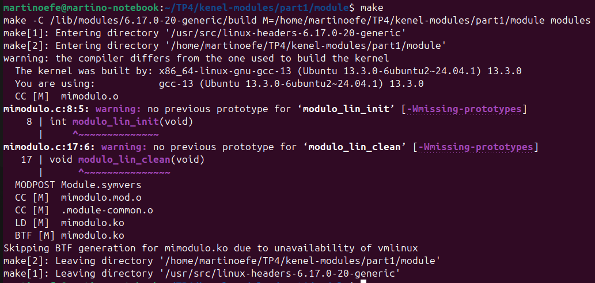

El comando `make` compila `mimodulo.c` y genera el archivo `mimodulo.ko`, que es el formato que el kernel puede cargar.

El `Makefile` invoca al sistema de compilación del kernel para generar `mimodulo.ko`. El proceso pasa por varias etapas:
- `CC [M] mimodulo.o` → compila el fuente en C
- `LD [M] mimodulo.ko` → linkedita y genera el módulo final

### 4. Carga del módulo

```bash
sudo insmod mimodulo.ko
sudo dmesg | tail
```

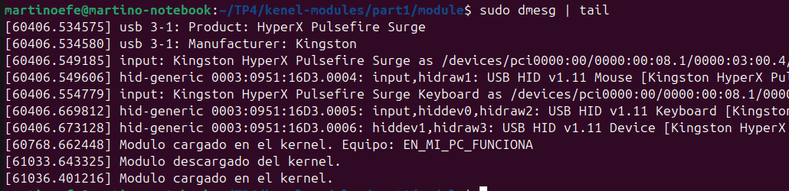

`insmod` inserta el módulo dentro del kernel en ejecución. Con `dmesg` vemos el log del kernel. Es importante notar que `dmesg` muestra el historial completo del kernel, por lo que pueden aparecer cargas anteriores del módulo. La línea relevante es siempre la última:

- `Modulo cargado en el kernel.` → mensaje que imprime el propio módulo desde su función `module_init()`


### 5. Verificación con lsmod

```bash
lsmod | head -20
```

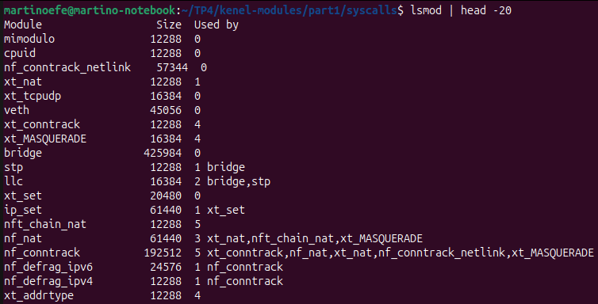

`lsmod` lista todos los módulos activos en el kernel. Las columnas significan:
- `Module` → nombre del módulo
- `Size` → cuánta memoria ocupa en bytes
- `Used by` → cuántos otros módulos o procesos lo están usando

En la primera fila se ve `mimodulo` con `Used by` en 0, lo que significa que está cargado pero ningún otro módulo depende de él todavía.

### 6. Información del módulo

```bash
modinfo mimodulo.ko
```

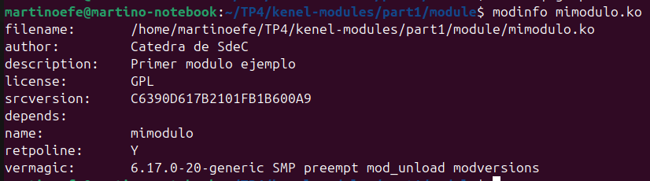

`modinfo` muestra los metadatos del módulo. Los campos más importantes son:
- `author` → quién lo escribió
- `description` → qué hace el módulo
- `license` → bajo qué licencia está distribuido
- `vermagic` → versión del kernel para la que fue compilado, tiene que coincidir con el kernel en ejecución
- `depends` → vacío, no depende de ningún otro módulo

### 7. Descarga del módulo

```bash
sudo rmmod mimodulo
sudo dmesg | tail
```

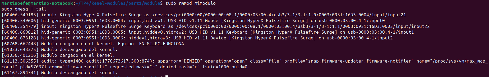

`rmmod` elimina el módulo del kernel en ejecución. Al igual que con la carga, `dmesg` muestra el historial completo por lo que aparecen entradas anteriores. La última línea es la relevante:

- `Modulo descargado del kernel.` → mensaje que imprime el módulo desde su función `module_exit()`

Se puede ver también en el historial la carga con el nombre del equipo de una prueba anterior (`Equipo: EN_MI_PC_FUNCIONA`), lo que ilustra bien cómo `dmesg` acumula todos los eventos del kernel durante la sesión.

### 8. Módulo con nombre del equipo

Se modificó `mimodulo.c` para que imprima el nombre del equipo al cargarse. En los módulos de kernel no se puede usar `printf` porque esa función pertenece a la libc que solo está disponible en user space. En su lugar se usa `printk`, que escribe directamente en el log del kernel (visible con `dmesg`):

```c
printk(KERN_INFO "Modulo cargado en el kernel. Equipo: EN_MI_PC_FUNCIONA\n");
```

`KERN_INFO` es el nivel de prioridad del mensaje. El kernel tiene distintos niveles (ERROR, WARNING, INFO, DEBUG) para clasificar los mensajes del log.

Luego se recompiló y recargó el módulo:


```bash
make
sudo insmod mimodulo.ko
sudo dmesg | tail
```

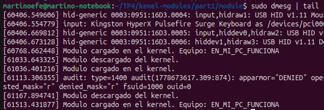

En la última línea del log se confirma que el módulo se cargó correctamente imprimiendo el nombre del equipo.

---

## Desafío #1 - Seguridad del Kernel

### ¿Qué es checkinstall y para qué sirve?

`checkinstall` reemplaza al `make install` tradicional. En lugar de copiar archivos sueltos por todo el sistema sin registro, intercepta la instalación y genera un paquete `.deb` que el gestor de paquetes puede trackear, actualizar y desinstalar limpiamente.

El problema con `make install` es que no hay forma fácil de desinstalar lo que instaló, porque no queda registro de qué archivos tocó. Con `checkinstall` en cambio, podés hacer `apt remove` como con cualquier otro paquete.

Para empaquetar un hello world:

```bash
# Primero creamos el programa
cat > hello.c << EOF
#include <stdio.h>
int main() {
    printf("Hello World\n");
    return 0;
}
EOF

# Compilamos
gcc hello.c -o hello

# Empaquetamos con checkinstall
sudo checkinstall --pkgname=hello-world --pkgversion=1.0 cp hello /usr/local/bin/
```

Esto genera un `.deb` instalable y registrado en el sistema.

### ¿Cómo evitar cargar módulos sin firma? ¿Qué son los rootkits?

Un **rootkit** es software malicioso que se instala con privilegios de root y se oculta del sistema operativo. Un rootkit implementado como módulo de kernel es especialmente peligroso porque corre con los máximos privilegios y puede interceptar cualquier syscall, ocultar procesos, archivos o conexiones de red, y es prácticamente indetectable desde user space.

Para evitar cargar módulos sin firma hay dos mecanismos principales:

**Secure Boot** verifica criptográficamente cada componente del arranque. Con Secure Boot activo, el kernel solo acepta módulos firmados con claves de confianza. Cualquier módulo sin firma o con firma no reconocida es rechazado con `module verification failed`.

**Module signing** permite firmar módulos individualmente. El proceso es:

```bash
# Generar par de claves
openssl req -new -x509 -newkey rsa:2048 -keyout signing_key.pem \
  -out signing_cert.pem -days 365 -subj "/CN=Module Signing/"

# Firmar el módulo
/usr/src/linux-headers-$(uname -r)/scripts/sign-file \
  sha256 signing_key.pem signing_cert.pem mimodulo.ko

# Enrollar la clave pública en el sistema
sudo mokutil --import signing_cert.pem
```

Con esto el kernel reconoce la firma y carga el módulo sin warnings. Sin este mecanismo, cualquiera puede escribir un módulo malicioso e insertarlo en el kernel.

---

## Desafío #2 - Módulos vs Programas

### ¿Qué funciones tiene disponible cada uno?

Un programa de usuario puede llamar cualquier función de la **libc** (`printf`, `malloc`, `fopen`, etc.), que por abajo hace syscalls al kernel. Podemos ver exactamente qué syscalls hace con `strace` (ver pregunta 6 de la parte practica).

Un módulo en cambio no tiene acceso a la libc. Las únicas funciones que puede llamar son las que el kernel exporta explícitamente. Todas esas funciones están listadas en `/proc/kallsyms`:

```bash
cat /proc/kallsyms | head -20
```

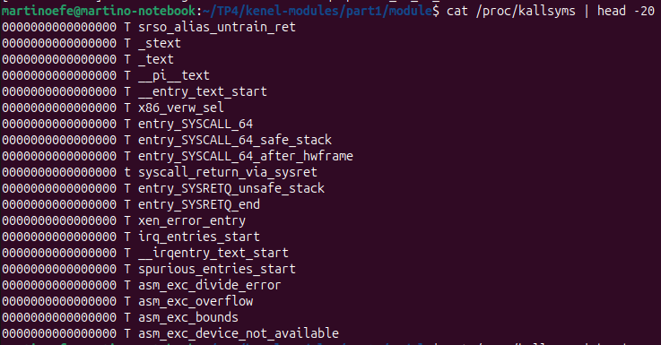

Cada línea muestra la dirección en memoria, el tipo de símbolo y el nombre de la función. Por eso en un módulo usamos `printk` en lugar de `printf`, `kmalloc` en lugar de `malloc`, etc. — son las versiones que el kernel exporta para uso interno.

### Espacio de usuario vs espacio de kernel

El procesador implementa distintos niveles de privilegio. En x86 se llaman rings: los programas de usuario corren en **ring 3** (mínimo privilegio) y el kernel en **ring 0** (máximo privilegio).

Esto significa que:
- Un programa de usuario **no puede** acceder directamente al hardware, a la memoria de otros procesos, ni a la memoria del kernel
- Un módulo **sí puede** hacer todo eso porque corre en ring 0, igual que el kernel

Cuando un programa necesita algo del kernel (leer un archivo, crear un proceso, etc.) hace una **syscall**, que es el mecanismo controlado para cruzar de ring 3 a ring 0 y volver.

### Espacio de datos

Cada proceso de usuario tiene su propio espacio de memoria virtual aislado: no puede leer ni escribir la memoria de otro proceso. Si lo intenta, recibe un segmentation fault.

El kernel tiene su propio espacio de datos separado de todos los procesos. Los módulos, al formar parte del kernel, comparten ese espacio. Esto tiene una consecuencia crítica: **un bug en un módulo puede corromper datos de cualquier parte del kernel**, incluyendo estructuras de otros módulos, del scheduler, del filesystem, etc. No hay aislamiento. Por eso un error en un módulo puede tirar todo el sistema, mientras que el mismo error en un programa de usuario solo mata ese proceso.

### Drivers y /dev

Una clase particular de módulo es el **driver** o controlador de dispositivo. En Linux, los dispositivos se representan como archivos en `/dev`:

```bash
ls -l /dev | head -20
```

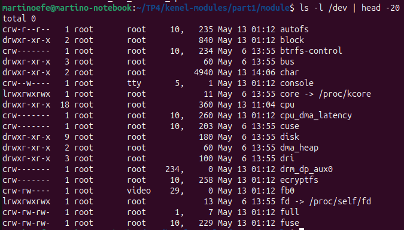

La primera letra indica el tipo de dispositivo:
- `c` → character device: se accede byte a byte (terminales, mouse, teclado)
- `b` → block device: se accede en bloques con buffer (discos)
- `l` → link simbólico hacia otro archivo o directorio
- `d` → directorio que agrupa dispositivos relacionados

Donde normalmente aparece el tamaño de un archivo, en dispositivos aparecen dos números separados por coma. El primero es el **número mayor** y el segundo el **número menor**.

El **número mayor** identifica qué driver maneja el dispositivo. El **número menor** identifica cuál dispositivo específico es dentro de ese driver.

---

## Preguntas

### 1. ¿Qué diferencias hay entre los dos modinfo?

```bash
modinfo mimodulo.ko
modinfo /lib/modules/$(uname -r)/kernel/crypto/des_generic.ko.zst
```

**Nuestro módulo:**


**Módulo oficial del kernel:**

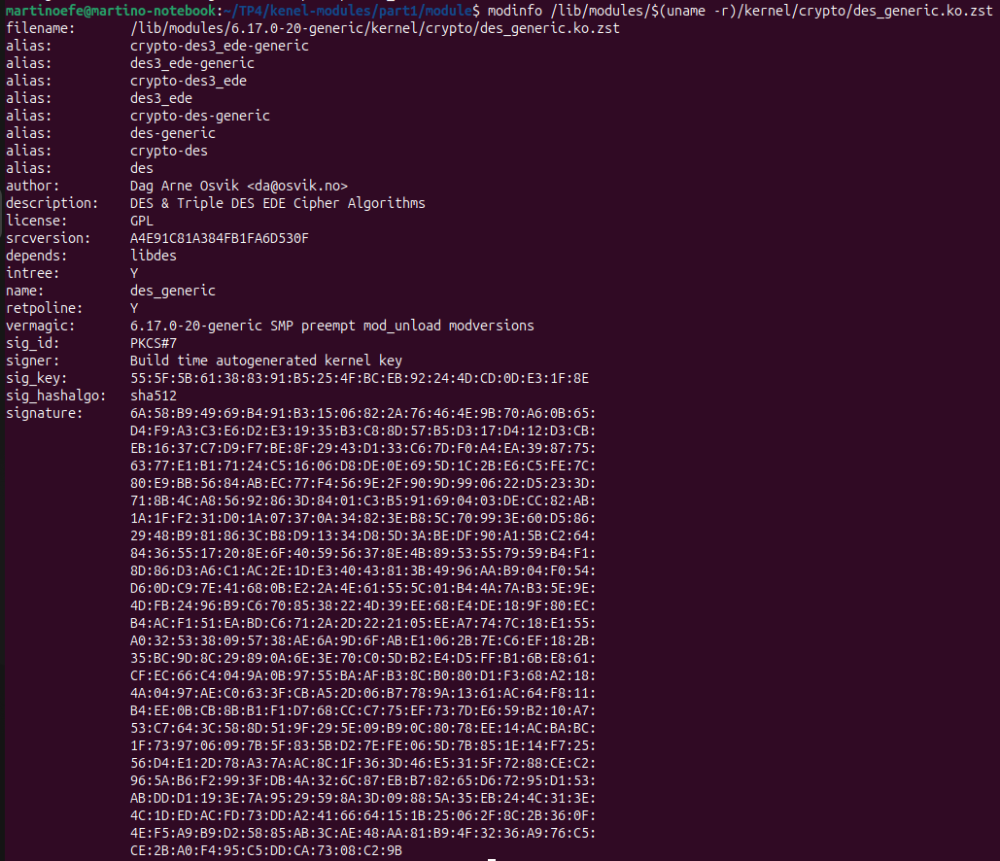

| Campo | mimodulo.ko | des_generic.ko |
|---|---|---|
| intree | no aparece | Y (oficial del kernel) |
| alias | ninguno | múltiples |
| depends | ninguno | libdes |
| signer | ninguno | Build time autogenerated kernel key |
| sig_hashalgo | ninguno | sha512 |
| signature | ninguna | firma PKCS#7 larga |

El módulo oficial está firmado criptográficamente con PKCS#7 usando sha512, generada automáticamente al compilar el kernel. El nuestro no tiene firma, por eso al cargarlo aparece el warning de `tainting kernel`. Además `des_generic` tiene múltiples aliases porque implementa varios algoritmos, y depende de `libdes`. Nuestro módulo no tiene ninguna dependencia porque no hace nada complejo.

### 2. ¿Qué drivers están cargados en cada PC? Comparación entre integrantes

# HACER cada uno y que el ultimo corra el comando

Cada integrante corrió:

```bash
lsmod > lsmod_nombreintegrante.txt
diff lsmod_integrante1.txt lsmod_integrante2.txt
```


Las diferencias se explican por el distinto hardware de cada máquina. Por ejemplo, distintas placas de video o de red wifi cargan módulos diferentes.

### 3. ¿Cuáles módulos no están cargados pero están disponibles?

```bash
ls /lib/modules/$(uname -r)/kernel/
```

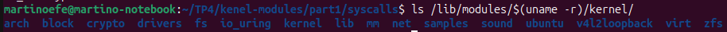

Cada directorio representa una categoría de módulos disponibles:

| Directorio | Descripción |
|---|---|
| `drivers/` | Controladores de hardware (USB, PCI, audio, etc.) |
| `fs/` | Sistemas de archivos (ext4, btrfs, nfs, etc.) |
| `net/` | Protocolos de red (IPv6, bluetooth, etc.) |
| `crypto/` | Algoritmos criptográficos |
| `sound/` | Drivers de audio (ALSA) |

El kernel solo carga los módulos que necesita en cada momento. Si un dispositivo no está conectado, su driver no se carga; si un filesystem no está montado, su módulo tampoco. Si el módulo necesario no existe o falla al cargar, el hardware o funcionalidad simplemente no estará disponible.

### 4. hwinfo

```bash
sudo apt install hwinfo
sudo hwinfo --short
```

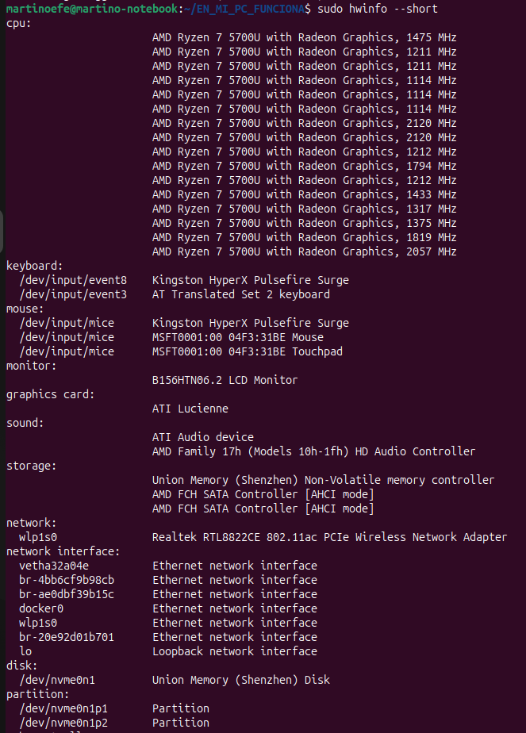
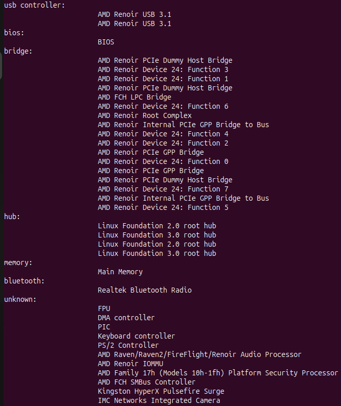

Muestra todo el hardware detectado y qué módulo está usando cada componente.

### 5. ¿Qué diferencia hay entre un módulo y un programa?

La diferencia principal es dónde corren:

Un **programa** corre en user space: tiene su propia memoria, usa la libc, hace syscalls para pedirle cosas al kernel. Si explota, solo muere el proceso y el sistema sigue andando. Empieza en `main()` y termina cuando llega al final del código.

Un **módulo** corre en kernel space: comparte la memoria del kernel, no puede usar libc, solo puede llamar funciones que el kernel exporta (visibles en `/proc/kallsyms`). Si tiene un bug puede tirar todo el sistema. Empieza en `module_init()` al cargarse y termina en `module_exit()` al descargarse.

### 6. ¿Cómo ver las syscalls de un hello world?

Con `strace` podemos ver exactamente qué syscalls hace un programa al ejecutarse:

```bash
gcc -Wall ejemplo_printf.c -o ejemplo_printf
strace -tt ./ejemplo_printf
strace -c ./ejemplo_printf
```

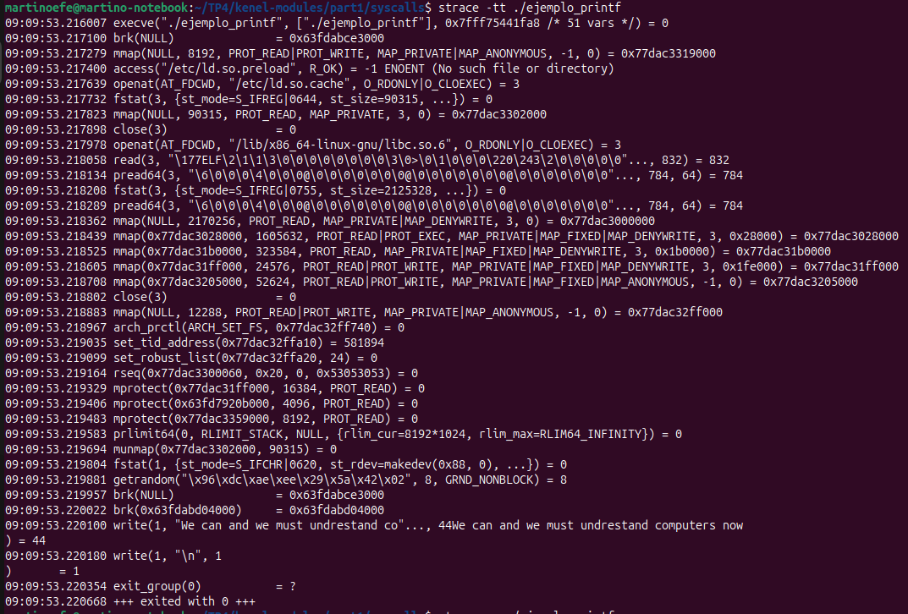

Con `-tt` se ve el flujo real de ejecución: antes de llegar al `printf`, el kernel carga el binario (`execve`), mapea memoria (`mmap`), abre la libc (`openat`), y recién al final aparece el `write()` que imprime el texto.

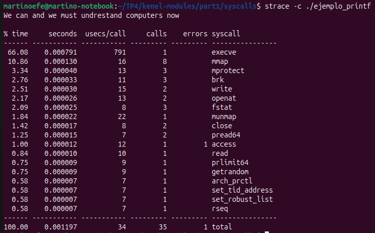

Con `-c` se ve la tabla resumen. El `execve` solo se llamó una vez pero consumió el 66% del tiempo total, lo que muestra que la mayor parte del trabajo es la inicialización, no el `printf` en sí.

Lo llamativo es que un programa de una línea termina haciendo más de 35 syscalls solo para iniciarse y terminar.

### 7. ¿Qué es un segmentation fault?

Es cuando un proceso intenta acceder a una dirección de memoria que no le pertenece, por ejemplo desreferenciar un puntero nulo o escribir fuera de un array. El hardware detecta el acceso inválido, le avisa al kernel, y el kernel le manda la señal `SIGSEGV` al proceso. El proceso muere con el mensaje "Segmentation fault" pero el resto del sistema no se entera.

En un módulo de kernel en cambio, si pasa algo así no hay nadie que lo atrape limpiamente. Se puede corromper memoria del kernel y causar un kernel panic que tira todo el sistema.

### 8. Firmado de un módulo de kernel (HACER)

### 9. Evidencia de compilación, carga y descarga del módulo

Ver sección "8. Módulo con nombre del equipo" en el Desarrollo.

### 10. ¿Qué pasa si un compañero con Secure Boot intenta cargar un módulo firmado por nosotros?

Secure Boot es un mecanismo del firmware UEFI que verifica que cada componente del arranque esté firmado con una clave de confianza: bootloader, kernel y módulos. Su objetivo es impedir que software malicioso como bootkits o rootkits se ejecute antes del sistema operativo, donde tendría máximo privilegio y sería muy difícil de detectar.

Dado esto, un compañero no puede cargar nuestro módulo. Al firmarlo con nuestra clave privada, para que otro sistema lo acepte nuestra clave pública tendría que estar enrolada en ese sistema con `mokutil`, lo cual requiere acceso físico a la máquina para confirmarlo en el arranque. Sin eso, el kernel rechaza la carga con `module verification failed`.

### 11. Artículo: parche de Microsoft y GRUB

**a. ¿Cuál fue la consecuencia principal del parche?**
Microsoft publicó un parche para cerrar una vulnerabilidad de Secure Boot en GRUB. El parche revocó certificados viejos que GRUB usaba para arrancar, lo que rompió sistemas dual-boot Linux/Windows porque Linux ya no podía arrancar con esos certificados revocados.

**b. ¿Qué implica desactivar Secure Boot como solución?**
Funciona a corto plazo pero deja el sistema sin la protección de la cadena de arranque verificada. Cualquier bootloader o módulo sin firma podría cargarse, abriendo la puerta a rootkits que se instalan antes del sistema operativo.

**c. ¿Cuál es el propósito principal de Secure Boot?**
Garantizar que todo el proceso de arranque esté firmado con claves de confianza, previniendo que código malicioso se ejecute antes del sistema operativo, donde tiene máximo privilegio y mínima visibilidad para el usuario.